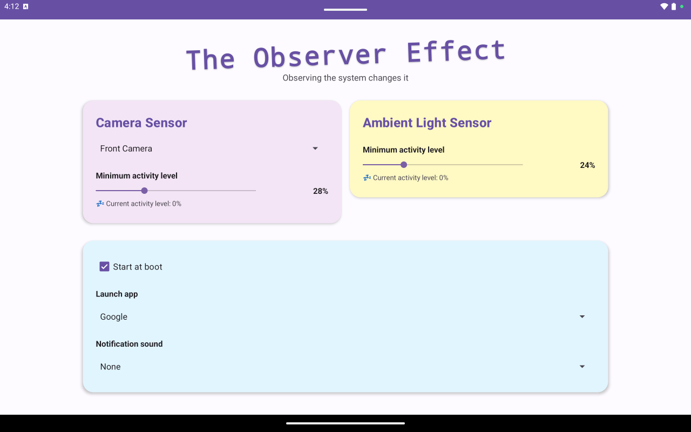
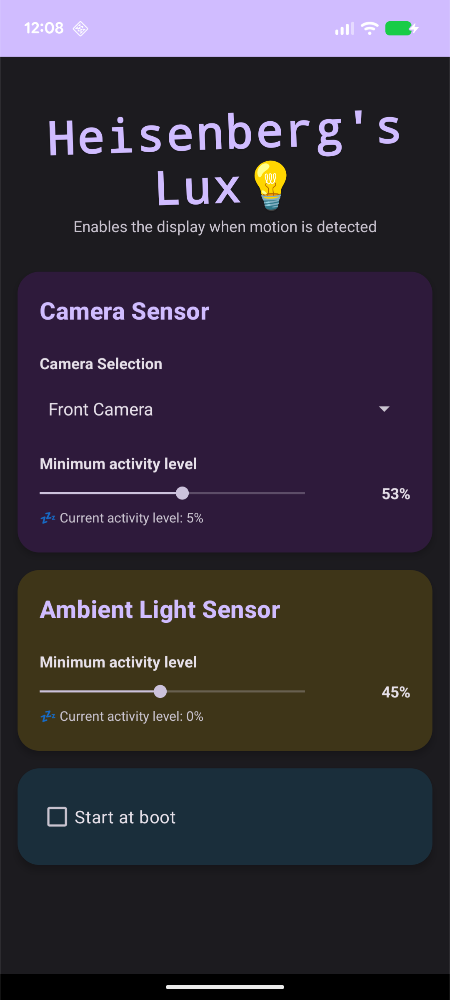

# The Observer Effect

**Auto-unlock and auto-open when movement is detected.**

Configures your Android device to automatically unlock and optionally open an application when it detects your presence using the camera and ambient light sensors. 

While initially designed for an Android-based home security system, it's also perfect for Home Assistant, Calendars, and Public Transit schedules. No more tapping the screen—just walk up and it's ready. This app is similar in concept to [Yakk](https://yakk.bkappz.com/), but I didn't know it existed when I started hacking on this. In comparison, TOE is open-source, with support for more sensors and different customization options. TOE does not record video or store data other than your configuration data. TOE does not require any network access.

## Screenshots

**Tablet View (light mode)**



**Mobile View (dark mode)**



## Features

- **Motion detection** - Detects when you walk up using the camera or light sensor
- **Automatic unlock** - Wakes up and unlocks your device (works with swipe-to-unlock or no lock screen security)
- **Launch your favorite app** - Automatically opens your chosen app (Home Assistant, calendar, transit schedule, etc.)
- **Fast startup** - Optional instant app loading so your app appears immediately
- **Notification sound** - Optional sound to let you know the device has woken up
- **Automatic start** - Starts working when you turn on your device, no need to open the app
- **Works on budget devices** - Runs smoothly even on cheap tablets with limited memory
- **Clean and simple** - Easy-to-use interface that works on both phones and tablets
- **Accessibility support** - Works with TalkBack for vision-impaired users

## Installation

1. Download the latest APK file from the [Releases](../../releases) page
2. On your Android device, open the downloaded APK file
3. If prompted, allow installation from unknown sources
4. Tap "Install"
5. Once installed, open The Observer Effect and follow the setup prompts

**Requires Android 8.0 or newer**

## Getting Started

The Observer Effect is designed to be simple to use, even if you're not a technical user. Just install the app and follow the on-screen prompts.

### Permissions

**The app will automatically prompt you for the following permissions when you first launch it:**

- **Camera** - Allows the app to detect when you approach the device
- **Display over other apps** - Lets the app wake up your device and launch your chosen app
- **Battery optimization exemption** - Keeps the app running in the background so it can detect your presence

Simply tap "Allow" or "Grant" when prompted. These permissions are required for the app to work.

### Important: Background Management (Low-End Devices)

**If you have a budget tablet or low-end Android device**, you may need to manually allow the app to run in the background without being killed by the system. Without this setting, the app won't be able to detect your presence when the screen is off.

**How to allow background operation:**

- **AllWinner tablets**: Go to **Settings → Background Manage** and add The Observer Effect to the allowed apps list
- **Other devices**: Look for settings like "Battery Management", "App Battery Saver", "Background Apps", or "Protected Apps" in your device settings and ensure The Observer Effect is allowed to run in the background

If you're not sure where to find this setting, search your device settings for "background" or "battery optimization" and look for The Observer Effect in the list.

## Performance

The Observer Effect is optimized to run on a wide range of devices, from high-end tablets to budget Chinese tablets:

**Low-end device optimizations:**
- Camera frames throttled to ~5 FPS to reduce CPU usage by 80%
- Automatic memory management - pauses detection during low memory conditions
- Low resolution processing (320×240) for minimal resource usage
- Efficient pixel sampling (10% of pixels, ~7,680 samples per frame)

**High-end device features:**
- Optional app preload for instant appearance (100-300ms vs 2-5 seconds)
- Zero-animation transitions for snappy responsiveness
- 3-second cooldown between triggers to prevent spam

**Recommendations for cheap tablets (<2GB RAM):**
- Use the ambient light sensor instead of camera (near-zero CPU usage)
- Disable app preload to save memory
- Choose simple launch apps (launchers, calendars) over browsers

---

## For Developers

### Building from Source

You are probably best off using Android Studio, but we have make targets too:

```bash
make              # Build debug APK → out/observer-effect-debug.apk
make release      # Build release APK → out/observer-effect-release.apk
make sideload     # Install via adb
```

**Requirements:** JDK 17+

## License

Apache 2.0
