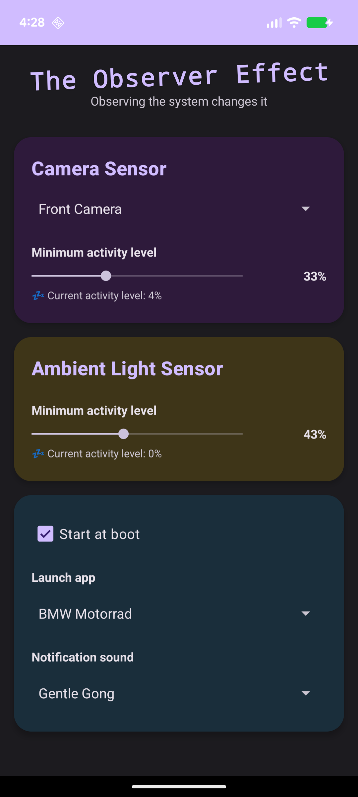

# The Observer Effect

I wanted my wall-mounted home automation tablets to light up as I walked by. This app wakes the screen when it detects motion or light changes, and can optionally launch any app you want.

Works great for Home Assistant dashboards, Alarmo alarm panels, or any app you want to see when you approach a mounted tablet. No more tapping the screen to wake it.

Similar concept to [Yakk](https://yakk.bkappz.com/), but open-source and with more sensors (camera + light) and the ability to auto-unlock and launch apps.

The name refers to the observer effect in physics, where the act of observation changes what is being observed—in this case, your approach to the tablet causes it to wake up.

## Screenshots

**Tablet View**


**Mobile View**



## Features

- Camera motion detection with adjustable sensitivity
- Ambient light sensor for detecting lighting changes
- Auto-unlock screen and launch your dashboard app
- Start at boot for set-and-forget operation
- Material Design 3 with dark mode and tablet layouts
- Full accessibility support with TalkBack

## Setup Recommendations

**For best results, disable your device's lock screen security:**

Go to **Settings → Security → Screen Lock** and set it to **"None"** or **"Swipe"**.

**Why?** Android's security model prevents apps from bypassing PIN, pattern, or biometric authentication. If you have secure lock screen enabled, the app will wake the screen but you'll still need to authenticate manually. For wall-mounted tablets that don't leave your home, disabling the lock screen provides the smoothest experience.

If you need security, consider using Smart Lock (Settings → Security → Smart Lock) with trusted locations or devices instead.

## Building

```bash
make              # Build debug APK → out/heisenberg-debug.apk
make release      # Build release APK → out/heisenberg-release.apk
make sideload     # Install via adb
```

**Requirements:** Android 8.0+, JDK 17+

See [CLAUDE.md](CLAUDE.md) for detailed build instructions and architecture documentation.

## License

Apache 2.0
